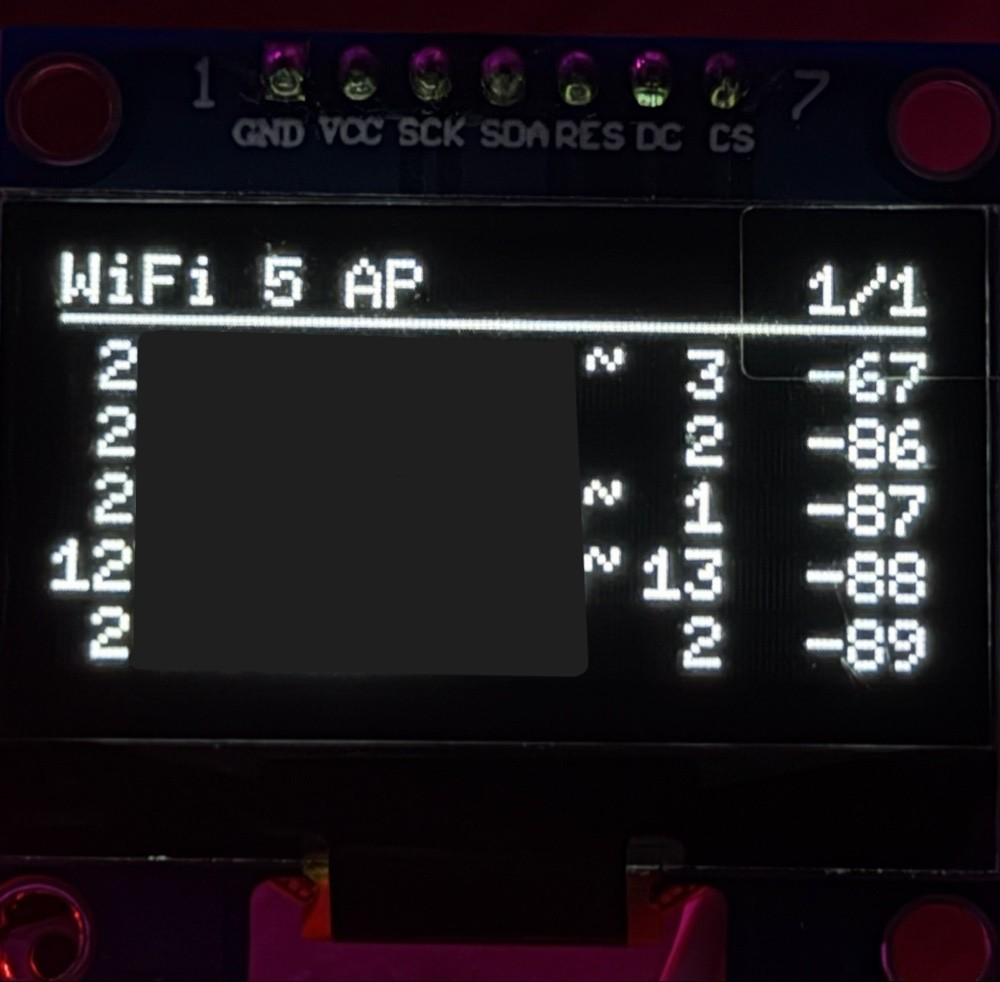

# ESP32 WiFi Scanner

A standalone WiFi survey tool for the ESP32. It scans the 2.4 GHz band on a
timer and shows what it finds on a 128×64 OLED: SSID, channel, signal strength
in dBm, and a two-character encryption marker, sorted strongest-first. Because
five rows do not fit twenty-four networks, the list is paginated and the pages
advance on their own every three seconds, with the header showing the total
count and the current page. The same data goes out over the serial port in a
wider format for debugging. The scan runs asynchronously, so paging keeps
moving while the radio is busy.



*Network names are redacted. The fourth row reads `12` — a WPA/WPA2 mixed-mode
network that earlier versions of this code would have reported as `2`. See
[Reporting the weakest accepted method](#reporting-the-weakest-accepted-method).*

What the display looks like, with the layout constants that produce it:

```
 y=8    WiFi 24/37 AP *        2/5
 y=10   ────────────────────────────
 y=21  12 Nazev-site~      6  -41
 y=31   - FreeWifi         1  -58
 y=41   3 <hidden>        11  -67
 y=51  23 UPC12345678      6  -72
 y=61   w StaraSitVeS~     3 -100
```

The leading two characters are the encryption mode, reported by the **weakest
method the network accepts** — `12` means WPA/WPA2 mixed, which still serves WPA
clients. The full legend and the reasoning are in
[Reporting the weakest accepted method](#reporting-the-weakest-accepted-method).

`24/37` means twenty-four networks are stored out of thirty-seven actually seen;
see [Showing what was dropped](#showing-what-was-dropped). The `*` means a scan
is in progress right now.

## Hardware

- **ESP32-WROOM-32D** on a generic dev board (Arduino board type: *ESP32 Dev Module*)
- **128×64 OLED, SH1106 controller, 4-wire SPI**

| OLED pin | ESP32 pin | Note |
|---|---|---|
| GND | GND | |
| VCC | 3.3V | not 5V |
| SCK | 18 | hardware SPI clock, fixed by the SPI peripheral |
| SDA | 23 | hardware SPI MOSI, fixed by the SPI peripheral |
| RES | 17 | passed to the U8g2 constructor |
| DC  | 16 | passed to the U8g2 constructor |
| CS  | 5  | passed to the U8g2 constructor |

SCK and SDA are not free choices — they are the ESP32's hardware SPI pins, and
the `_4W_HW_SPI` U8g2 constructor uses them implicitly. Only RES, DC and CS are
arguments, and they appear in one place, at the top of
[`view_oled.cpp`](view_oled.cpp).

Some modules of this size ship with an SSD1306 controller instead. If the image
comes out shifted or scrambled, the alternative constructor is on the next line
of that file, commented out.

## Getting started

1. Install the [Arduino IDE](https://www.arduino.cc/en/software) (2.x).
2. **File → Preferences → Additional boards manager URLs**, add:
   ```
   https://espressif.github.io/arduino-esp32/package_esp32_index.json
   ```
3. **Tools → Board → Boards Manager**, search `esp32`, install
   *esp32 by Espressif Systems*. **This project targets the 3.x series** and was
   developed against **3.3.11**. It maps `WIFI_AUTH_OWE` and
   `WIFI_AUTH_WPA3_ENT_192`, which do not exist in core 2.x, so it will not
   compile there. There are no `#if` version guards: a stated target version is
   easier to trust than conditional compilation guessing at a threshold.
4. **Tools → Board → ESP32 Arduino → ESP32 Dev Module**.
5. **Tools → Manage Libraries**, search `U8g2`, install *U8g2 by oliver*.
6. Open [`WiFi_scanner.ino`](WiFi_scanner.ino). The other files appear as tabs
   automatically — Arduino compiles every `.ino`, `.cpp` and `.h` in the sketch
   folder, so there is nothing else to install or configure.
7. Select the serial port and upload. Open the Serial Monitor at **115200 baud**.

`WiFi.h` and `SPI.h` come with the ESP32 core. U8g2 is the only external
dependency.

## How it is built

```
ScanSource ──fills──> NetList ──reads──> view_oled    (128×64, paginated)
   (WiFi)             (model)      └──> view_serial   (full SSID + BSSID)
                                          ▲
                        WiFi_scanner.ino ──┘  decides WHEN, never HOW
```

| File | Role |
|---|---|
| [`netlist.h`](netlist.h) / [`.cpp`](netlist.cpp) | The model. A fixed-size array of networks, permanently sorted by signal strength. Knows nothing about WiFi, the display, or the serial port. |
| [`netsource.h`](netsource.h) | The interface a data source has to implement: `begin()`, a non-blocking `poll()`, and read-only access to the model. |
| [`scansource.h`](scansource.h) / [`.cpp`](scansource.cpp) | The one implementation there is today: an asynchronous `WiFi.scanNetworks()` wrapped in a two-state machine. Contains no output code of any kind. |
| [`view_oled.h`](view_oled.h) / [`.cpp`](view_oled.cpp) | Owns the U8g2 instance and does all drawing. Contains no scanning code. |
| [`view_serial.h`](view_serial.h) / [`.cpp`](view_serial.cpp) | The second view over the same model. Prints full, untruncated SSIDs plus BSSID. |
| [`config.h`](config.h) | Capacities and timing, in one place. |
| [`WiFi_scanner.ino`](WiFi_scanner.ino) | Glue and clocks: page timer, redraw decisions. No `delay()`. |

**The seam is `netsource.h`, and it is there on purpose.** The rule the whole
layout enforces is that the module which acquires data never prints anything,
and the modules which print never acquire anything. `ScanSource` has no
`Serial.print` in it; the views never mention `WiFi`. That is what makes the
data source replaceable: swapping in a different one is two lines in the `.ino`
and touches neither view.

A concrete consequence of taking that seriously: the model does not store
`wifi_auth_mode_t` from ESP-IDF, because that would force both views to
`#include <WiFi.h>` and so depend on the data source. Instead the model defines
its own small `AuthKind` enum, and `scansource.cpp` holds the single translation
function. That file is the only place in the project where a WiFi-stack type
appears.

Code comments are in Czech; identifiers and this README are in English.

## Decisions worth explaining

### Reporting the weakest accepted method

A network in WPA/WPA2 mixed mode still serves WPA clients. An attacker takes the
weaker path, and the fact that the AP also speaks WPA2 does not get in their way.
Reporting that network as `WPA2` would describe its security as better than it
is — for a survey tool, that is the one direction of error that matters. So every
network is reported by **the weakest method it accepts**, and mixed modes get
their own markers instead of collapsing into the stronger generation.

| Marker | Meaning |
|---|---|
| `-`  | open, no encryption |
| `o`  | OWE / Enhanced Open — encrypted, but no password and no authentication |
| `w`  | WEP |
| `1`  | WPA only |
| `2`  | WPA2 only |
| `3`  | WPA3 only |
| `12` | mixed — accepts WPA as well as WPA2 |
| `23` | mixed — accepts WPA2 as well as WPA3 |
| `e1` | Enterprise (802.1X) at the WPA generation |
| `e2` | Enterprise at the WPA2 generation |
| `e3` | Enterprise at the WPA3 generation, including Suite-B 192-bit |
| `?`  | unrecognised (WAPI, DPP, anything added after core 3.3.11) |

The column is two characters wide, and that is a deliberate trade. Two digits
side by side read as "accepts both" without consulting a legend, which for a tool
someone glances at for five seconds is worth more than the one SSID character it
costs — the name column goes from 13 to 12 characters. The same scheme also
covers Enterprise: `e1`/`e2`/`e3` keeps the difference between WPA-Enterprise and
WPA3-Enterprise visible where a single `e` would have hidden it, and it means
WPA3-Enterprise Suite-B 192-bit does not have to be under-reported just to fit.
WPA3-Enterprise Transition Mode reports as `e2`, because WPA2-Enterprise is the
weakest generation it accepts. And the scheme extends itself: another mixed mode
would be written by the same rule, with no new letter to invent.

One mode is deliberately *not* treated as mixed. `WIFI_AUTH_WPA3_EXT_PSK_MIXED_MODE`
reports as `3`, because the ESP-IDF header states it yields the same result as
`WIFI_AUTH_WPA3_PSK`. The identifier suggests otherwise, but a documented
statement outranks an inference drawn from a name; the doubt is recorded in a
comment at the mapping site rather than acted on.

The mapping was written against
`esp_wifi_types_generic.h` from core 3.3.11, which defines seventeen auth modes —
including several the obvious implementation misses, such as `WPA_ENTERPRISE` and
the transition modes. Note also that `WIFI_AUTH_WPA2_ENTERPRISE` is an alias for
`WIFI_AUTH_ENTERPRISE` in that header, so only one of the two names can appear as
a `case` label.

### Asynchronous scan instead of a blocking one

`WiFi.scanNetworks()` with no arguments does not return until the scan finishes.
A scan visits all 13–14 channels and spends a couple of hundred milliseconds on
each, so `loop()` stalls for 2–4 seconds. Nothing else can happen in that
window: pages do not advance, the display is frozen for roughly a fifth of the
time.

`WiFi.scanNetworks(true, true)` returns immediately (the second `true` also
requests hidden networks). The scan proceeds in the WiFi task and the caller
polls `WiFi.scanComplete()`, which returns `-1` while running, `-2` on failure,
or the number of networks found. The cost is a two-state machine, entirely
contained in `scansource.cpp`; the sketch calls `poll()` and never learns that a
state machine exists.

Two details that are easy to miss: `WiFi.scanDelete()` has to be called after
reading the results, or they sit in the WiFi stack's memory until the next scan;
and there is a timeout guard, so a scan that never reports completion cannot
wedge the state machine permanently.

Time comparisons are written as `millis() - mark >= period`, never
`millis() > mark + period`. `millis()` wraps after about 49 days, and the second
form breaks for days when it does. Unsigned subtraction survives the wrap.

### No `String` in the data model

`NetInfo` stores the SSID as `char[33]` — 32 bytes maximum per 802.11, plus a
terminator. `WiFi.SSID()` hands back a `String`, so the data is copied into the
fixed array immediately and the `String` is dropped; nothing heap-allocated
outlives that one line.

The reason is fragmentation, not raw size. A device that runs for days and
rewrites its entire network list every fifteen seconds will chop the heap into
unusable pieces, and the allocation that eventually fails will do so at the
worst possible moment. Fixed arrays live in `.bss`: their size is known at
compile time and they cannot fail at runtime. `sizeof(NetInfo)` is 42 bytes and
the whole list is about 1 kB, against roughly 300 kB of DRAM free once the WiFi
stack is up.

### SSID sanitisation at the trust boundary

An SSID is 32 arbitrary bytes transmitted by someone else's hardware. Nothing
guarantees it is text. An AP can be named with ANSI escape sequences, and those
would let a stranger recolour, erase or reposition lines in the terminal reading
the serial output — debug output you cannot trust is worse than none. On the
display, bytes above 0x7E render as blanks anyway, because the `_tf` fonts cover
Latin-1 and no more.

So `collect()` keeps only printable ASCII (0x20–0x7E) and replaces everything
else with `.`. It happens once, at the point where bytes from the radio become
model data, rather than in each view — which buys a rule that is simple enough
to rely on: **anything in `NetList` is safe to print.**

An empty SSID stays empty. Turning it into `<hidden>` is a display decision, so
it belongs in the views, and each view is free to word it differently.

### Sorted insertion instead of a separate sort

`NetList::add()` puts each network directly into its place by RSSI. Three things
fall out of one piece of code: the ordering itself; the behaviour when the array
is full, where the weakest entry simply drops off the end; and an API shaped for
a source that produces networks one at a time rather than as a finished list.
Insertion sort over 24 elements is at worst about 290 comparisons, which is
nothing at 240 MHz. Ties keep their previous order, so networks with equal RSSI
do not swap places on every scan for no reason.

### Showing what was dropped

`MAX_NETS` is 24 by default. The limit is not memory — it is legibility, since
24 networks is five pages, and at three seconds a page a full cycle already
takes as long as one scan period.

But an array that silently drops the weakest entries makes the header lie: `24`
would mean "24 networks exist" when it really means "24 fit". So `NetList`
tracks how many networks it was *offered* alongside how many it *kept*. When
they differ the header reads `24/37 AP` and the serial output says how many were
discarded; when everything fits, a single number is shown. The distinction
between what a program observed and what it retained is worth two bytes of RAM.

## Known limitations

- **Hidden networks are unreliable.** `show_hidden` returns APs with a blank
  SSID, but an AP configured not to broadcast may also decline to answer an
  active scan, in which case it never appears at all. That is 802.11 behaviour,
  not a bug here.
- **The order fluctuates.** RSSI moves by a few dB between scans, so networks of
  similar strength trade places. Sorting is stable, so the jitter is no worse
  than the signal's own.
- **The display does not show the original SSID bytes.** Sanitisation is
  deliberate (see above), but it means a network named with non-ASCII characters
  shows up with dots. The raw bytes are not preserved anywhere.
- **An embedded NUL byte truncates the SSID upstream.** `WiFi.SSID()` returns a
  C string, so if an SSID contains a zero byte, everything after it is already
  gone before this code sees it. Fixing that would mean bypassing the Arduino
  WiFi layer and reading `wifi_ap_record_t` directly.
- **No diacritics.** `u8g2_font_6x10_tf` covers ASCII and Latin-1; `ě š č ř ž ů`
  are in Latin-2 and render as blanks. All on-screen strings are plain ASCII for
  that reason.
- **Long SSIDs are cut off.** 128 px at 6 px per character leaves 12 characters
  for the SSID once the encryption, channel and dBm columns are accounted for.
  Truncated names end in `~`. The serial output has the full name.
- **Not every encryption mode has been seen in the field.** The mapping table
  comes from the ESP-IDF header, and modes that need uncommon hardware to
  produce — OWE (Enhanced Open), WPA3-Enterprise 192-bit, WPA-Enterprise, WEP —
  have not been observed against a live network, so their on-screen output is
  derived rather than confirmed. The mixed-mode markers `12` and `23`, which are
  the point of the whole scheme, are the ones worth checking against a router's
  own admin page if you want to trust them.
- **2.4 GHz only.** The ESP32-WROOM-32D has no 5 GHz radio, so 5 GHz networks
  are invisible to this tool regardless of software.
- **Promiscuous mode and `scanNetworks()` cannot run simultaneously.** The radio
  does one or the other. `netsource.h` exists so that a frame-capturing source
  could be written and switched to, but no such source exists in this
  repository — the only implementation today is the scan.

## License

MIT — see [LICENSE](LICENSE).

## Notes

Written with [Claude Code](https://claude.com/claude-code).
